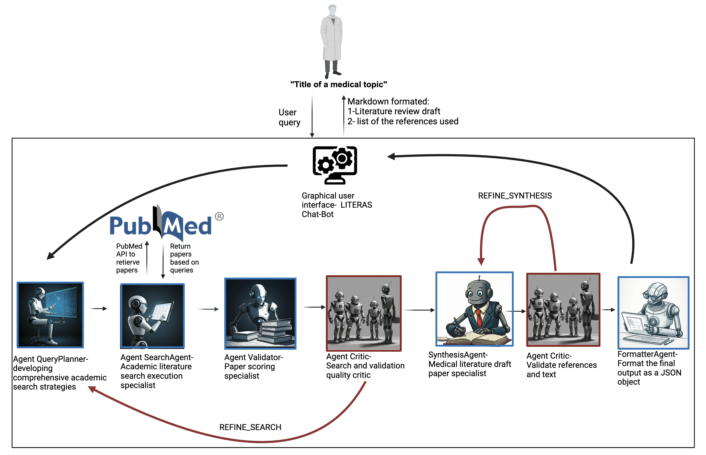

# LITERAS: Literature Review and Citation Retrieval Agents


**LITERAS** (Literature Review and Citation Retrieval Agents) is a multi-agent AI framework designed to streamline the process of academic literature reviews and citation retrieval for medical research. By leveraging the capabilities of large language models (LLMs) and advanced multi-agent systems, LITERAS enhances accuracy, reduces hallucinated references, and improves the quality of retrieved citations.

---

## Features

- **Multi-Agent Architecture**: Incorporates multiple specialized agents to divide tasks, ensuring modular, efficient, and context-aware collaboration.
- **Accurate Citation Retrieval**: Achieves 99.82% reference correctness by integrating PubMed API, validation loops, and quality control.
- **Enhanced Literature Review Drafting**: Generates structured drafts with summaries, research gaps, and objectives, ensuring high-impact citations.
- **Advanced Validation**: Includes criteria-based reference evaluation (e.g., relevance, recency, methodology, and impact factor).
- **User-Friendly Interface**: Features a chatbot-based GUI for easy interaction by researchers and clinicians.

---

## System Architecture

1. **Query Planner Agent**: Develops a comprehensive academic search strategy.
2. **Search Agent**: Executes the strategy using PubMed API to retrieve relevant articles.
3. **Validation Agent**: Scores and evaluates articles for quality and relevance.
4. **Critic Agent**: Provides secondary quality checks and ensures search refinements.
5. **Synthesis Agent**: Compiles findings into a structured literature review draft.
6. **Critic Agent (Reference & Text Review)**: Conducts a final check of the drafted text and references to ensure accuracy and clarity.
7. **Formatting Agent**: Formats outputs (e.g., JSON) for seamless integration into workflows.

---

## Installation

### Prerequisites

- Docker installed on your system.
- API key for OpenAI GPT (add it to the `.env` file).

### Steps

1. Clone this repository:
   ```bash
   git clone https://github.com/<username>/literas.git
   cd literas
   ```

2. Build and run the Docker container:
   ```bash
   docker-compose up --build
   ```

3. Access the application at `http://localhost:8000`.

---

## File Structure

- `agents.py`: Core logic for the multi-agent framework.
- `chat_handler.py`: Handles user interactions and chat-based input.
- `main.py`: Entry point for the FastAPI application.
- `tools.py`: Utility functions for agent workflows.
- `docker-compose.yml`: Docker configuration file to orchestrate the application.
- `Dockerfile`: Instructions to build the Docker image.
- `.env`: API key and environment variables.
- `requirements.txt`: Python dependencies for the project.

---

## Usage

1. **Start the Application**: Run the Docker container as described above.
2. **Input Query**: Provide a medical topic or research question.
3. **Receive Output**: Obtain a structured draft with validated references in JSON or PDF format.

---

## Performance Highlights

- Correctness Rate: 99.82%
- Referencing Accuracy: 96.8%
- Focus on high-impact journals (JCR Q1-Q2) and recent publications (2023–2024).
- Low error rates with minimal hallucinated data.

---

## Evaluation

- Tested across six medical fields: Oncology, Cardiology, Rheumatology, Psychiatry, Infectious Diseases, and Public Health.
- Comparative analysis with GPT-4 and Gemini Ultra demonstrates superior performance.

| Metric                | LITERAS | GPT-4 | Gemini Ultra |
|-----------------------|---------|-------|--------------|
| Correct References   | 99.82%  | 54%   | 77.2%        |
| Accurate References  | 96.8%   | 49.2% | 68%          |
| Median Impact Factor | Q1-Q2   | NA    | NA           |

---

## Citation

If you use LITERAS in your research, please cite:

```
Gorenstein A., Shihada K., Sorka M., Aran D., Shelly S. "LITERAS: Multi-Agent AI Framework for Accurate Literature Review and Citation Retrieval." GitHub, 2024.
```

---

## Contact

For any questions or collaboration inquiries, contact:
**Alon Gorenshtein**  
alon323@hotmail.com

---

## License

This project is licensed under the Apache 2 License. See the `LICENSE` file for details.

